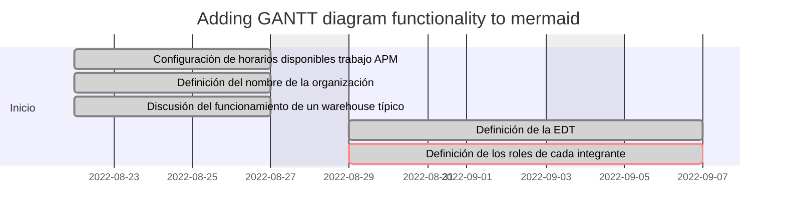

# WarePatch
This repo contains the development code for the WarePatch...

## Schedule

## References
[^current]: [Mercado Libre current system](https://www.youtube.com/watch?v=NIaEmq3eqvk&ab_channel=MercadoEnv%C3%ADos)
